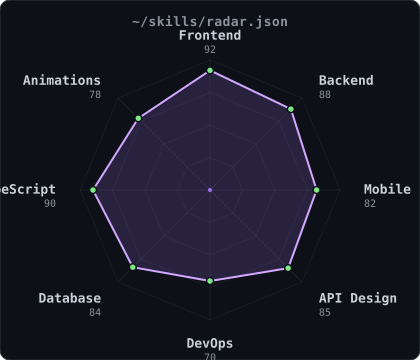
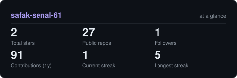
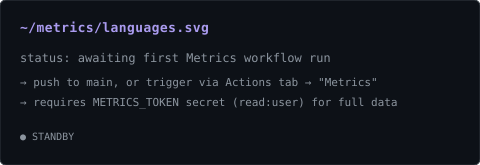

<!-- BANNER - terminal profile.sh --live (additive). Generated by scripts/banner/generate.py.
     ~0.9 MB each. Cache-bust with ?v=N after regenerating. -->
<picture>
  <source media="(prefers-color-scheme: dark)"  srcset="assets/banner-dark.v9.svg">
  <source media="(prefers-color-scheme: light)" srcset="assets/banner-light.v9.svg">
  
</picture>

 

<!-- NAME / TAGLINE - animated typing -->

 

<!-- SOCIALS — LinkedIn stays brand blue (glyph vanishes on custom fills). Others themed. -->
&nbsp;&nbsp;
&nbsp;&nbsp;

 

---

## This is me :)

Merhaba, ben **Şafak**, fullstack developer ve mobil mühendis, Türkiye'den yayın yapıyorum 🇹🇷.
Hem web hem mobil istemciler için uçtan uca ürünler geliştiriyorum, ve tek bir backend'i
3 farklı platforma (web + iOS + Android) aynı anda servis etmeye meraklıyım.

- 🏗️ **Fullstack geliştirici** — arka planda Node.js + Prisma + PostgreSQL, ön yüzde React/Next.js, mobil tarafta React Native + Expo ve Flutter.
- 📱 **Mobile-first mindset** — bir defada 3 istemci: web + iOS + Android. Tek backend, üç client, "3x verim" mantra'sı.
- ⚙️ **API-merkezli** — REST ve GraphQL servislerini konuşlandırıp, hem kendi istemcilerim hem de partnerlerim için dokümantasyonla birlikte teslim ederim.
- 🤖 AI agent development ile arka plan kodlamayı otomatikleştirmeye çalışıyorum; blockchain + AI kesişimi özellikle ilgimi çekiyor.
- 🌱 **Şu an öğreniyorum:** Rust ile sistem programlama, Kubernetes orkestrasyonu, AI agent geliştirme.
- 💬 Bana **React Server Components, Prisma ve FastAPI** konularında soru sorabilirsin; saatlerce konuşuruz.
 

## my perfect stack`

---

## signals 

<table>
<tr>
<td width="50%" align="center" valign="middle">

<!-- Self-rated radar - edit assets/skills.json, the workflow redraws it -->
<picture>
  <source media="(prefers-color-scheme: dark)"  srcset="assets/radar-dark.svg">
  <source media="(prefers-color-scheme: light)" srcset="assets/radar-light.svg">
  
</picture>

</td>
<td width="50%" align="center" valign="middle">

<!-- Hand-authored language stack radar - edit assets/langmix.json -->
<picture>
  <source media="(prefers-color-scheme: dark)"  srcset="assets/radar-langs-dark.svg">
  <source media="(prefers-color-scheme: light)" srcset="assets/radar-langs-light.svg">
  
</picture>

</td>
</tr>
</table>

---

## Numbers matter? ohhh yes. 

<!-- Generated by scripts/cards.py into this repo. Deliberately NOT
     github-readme-stats / streak-stats / github-profile-trophy: those are
     shared public instances that go down and take the whole section with them. -->
<picture>
  <source media="(prefers-color-scheme: dark)"  srcset="assets/card-stats-dark.svg">
  <source media="(prefers-color-scheme: light)" srcset="assets/card-stats-light.svg">
  
</picture>

 

<!-- Most used languages across all repos. Generated by scripts/cards.py -->

---

`Build with ☕ · @safak_senal_61`

