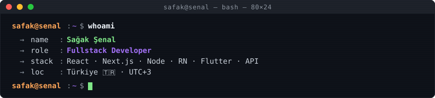

<!-- BANNER — terminal profile.sh --live. Lokal SVG, dış servislere bağımlılık yok.
     Dark/light mode desteği picture elementi ile. -->
<picture>
  <source media="(prefers-color-scheme: dark)"  srcset="assets/banner-dark.svg">
  <source media="(prefers-color-scheme: light)" srcset="assets/banner-light.svg">
  
</picture>

 

<!-- NAME / TAGLINE — animated typing -->

 

<!-- SOCIALS — LinkedIn brand blue, others themed mor -->
&nbsp;&nbsp;
&nbsp;&nbsp;
&nbsp;&nbsp;

 

---

## This is me :)

Merhaba, ben **Sağak Şenal**, fullstack developer, İstanbul'dan yayın yapıyorum 🇹🇷.
Hem web hem mobil istemciler için uçtan uca ürünler geliştiriyorum, ve tek bir backend'i
3 farklı platforma (web + iOS + Android) aynı anda servis etmeye meraklıyım.

- 🏗️ **Tam yığın geliştirici** — arka planda Node.js + Prisma + PostgreSQL, ön yüzde React/Next.js, mobil tarafta React Native + Expo ve Flutter ile.
- 📱 **Mobil öncelik** — bir defada 3 istemci: web + iOS + Android. Tek backend, üç client, "3x verim" mantra'sı.
- ⚙️ **API-merkezli** — REST ve GraphQL servislerini konuşlandırıp, hem kendi istemcilerim hem de partnerlerim için dokümantasyonla birlikte teslim ederim.
- 🎯 **Şu an öğreniyor:** Rust ile sistem programlama, Kubernetes orkestrasyonu, AI agent development.
- ☕ **İnanılmaz miktarda kahve içiyor** — genellikle 23:00-03:00 arası en verimli saatlerim.
- 💬 Bana **React Server Components, Prisma ve FastAPI** konularında soru sorabilirsin; saatlerce konuşuruz.
 

## `my perfect stack`

---

## `signals`

<table>
<tr>
<td width="50%" align="center" valign="middle">

<!-- Self-rated skill radar — elle üretilen SVG, repo'da host ediliyor -->
<picture>
  <source media="(prefers-color-scheme: dark)"  srcset="assets/radar-dark.svg">
  <source media="(prefers-color-scheme: light)" srcset="assets/radar-light.svg">
  
</picture>

</td>
<td width="50%" align="center" valign="middle">

<!-- GitHub stats card — lokal SVG, dış servislere bağımlılık yok -->
<picture>
  <source media="(prefers-color-scheme: dark)"  srcset="assets/card-stats-dark.svg">
  <source media="(prefers-color-scheme: light)" srcset="assets/card-stats-light.svg">
  
</picture>

</td>
</tr>
</table>

---

## `now playing`

<!-- Learning badges — pulse animasyonu ile -->

&nbsp;

&nbsp;

&nbsp;

&nbsp;

  

<!-- Typing footer -->

---

`Build with ☕ · @safak_senal_61`

